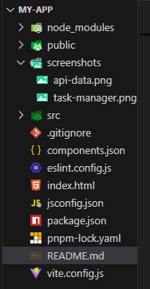
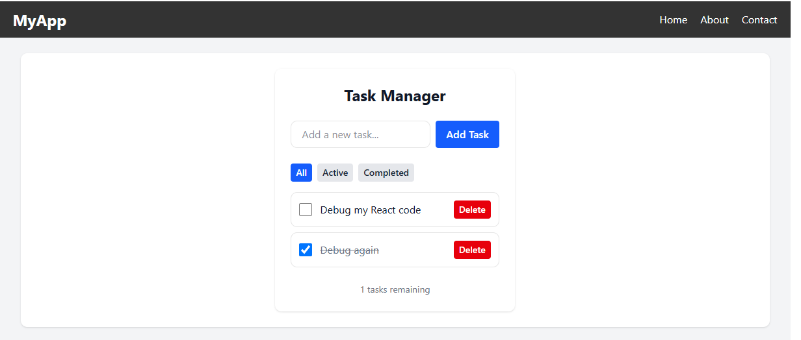
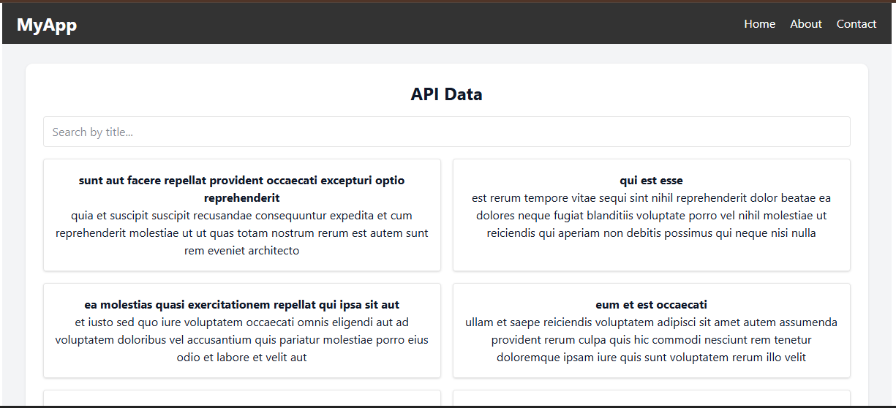

# My React App

A modern React application featuring a task manager and API data display, styled with Tailwind CSS.

## Table of Contents

- [Features](#features)
- [Screenshots](#screenshots)
- [Getting Started](#getting-started)
- [Available Scripts](#available-scripts)
- [Project Structure](#project-structure)
- [License](#license)

## Features

- Task management (add, remove, complete tasks)
- Fetch and display data from an API
- Responsive design with Tailwind CSS
- Dark mode support

## Screenshots

### Project Structure



### Task Manager



### API Data Section



> _Place your screenshots in a `screenshots/` folder at the root of your project._

## Getting Started

### Prerequisites

- [Node.js](https://nodejs.org/) (v18 or higher recommended)
- [pnpm](https://pnpm.io/) (or use npm/yarn if you prefer)

### Installation

1. **Clone the repository:**
   ```sh
   git clone https://github.com/your-username/your-repo.git
   cd my-app
   ```

2. **Install dependencies:**
   ```sh
   pnpm install
   # or
   npm install
   # or
   yarn install
   ```

3. **Start the development server:**
   ```sh
   pnpm dev
   # or
   npm run dev
   # or
   yarn dev
   ```

4. **Open your browser and visit:**
   ```
   http://localhost:5173
   ```

## Available Scripts

- `pnpm dev` – Start the development server
- `pnpm build` – Build for production
- `pnpm start` – Start the production server

## Project Structure

```
my-app/
├── public/
├── screenshots/
├── src/
│   ├── assets/
│   ├── components/
│   ├── lib/
│   ├── App.jsx
│   ├── main.jsx
│   └── index.css
├── .gitignore
├── package.json
├── pnpm-lock.yaml
├── README.md
└── vite.config.js
```
